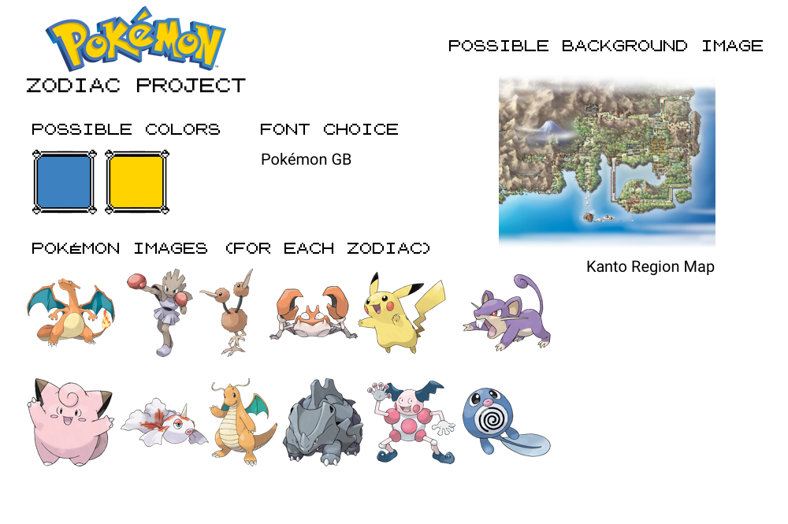

# Planning for Pokémon Zodiac

## Description

This website will have 12 Pokémon, one of which is assigned to someone based on their birthday. This could be any of the ones I listed below, in the Possible Pokémon section.

Users will be able to click on the images of Pokémon, which will surround the input form, and also be shown their descriptions and how they relate to their assigned Zodiac.

## Pokémon to Use

### Possible Pokémon
- Capricorn = Stantler?
- Aquarius = Vaporeon
- Pisces = Goldeen
- Aries = Miltank?
- Taurus = Tauros
- Gemini = Doduo
- Cancer = Kingler
- Leo = Arcanine
- Virgo = Wigglytuff? Chansey? Jynx?
- Libra = Hitmontop? Porygon2?
- Scorpio = Pinsir? Kabutops? Scyther? Gligar?
- Sagittarius = Stantler? Rapidash?

### According this this website

https://www.bustle.com/articles/173920-what-pokemon-are-you-based-on-your-zodiac-sign-your-birthday-tells-you-more-about-your

- Aries = Charizard
- Taurus = Hitmonchan
- Gemini = Doduo
- Cancer = Krabby
- Leo = Pikachu
- Virgo = Rattata
- Libra = Clefairy
- Scorpio = Goldeen
- Sagittarius = Dragonite
- Capricorn = Rhyhorn
- Aquarius = Mr. Mime
- Pisces = Poliwag

## Sample Wireframe

## Style Tile

